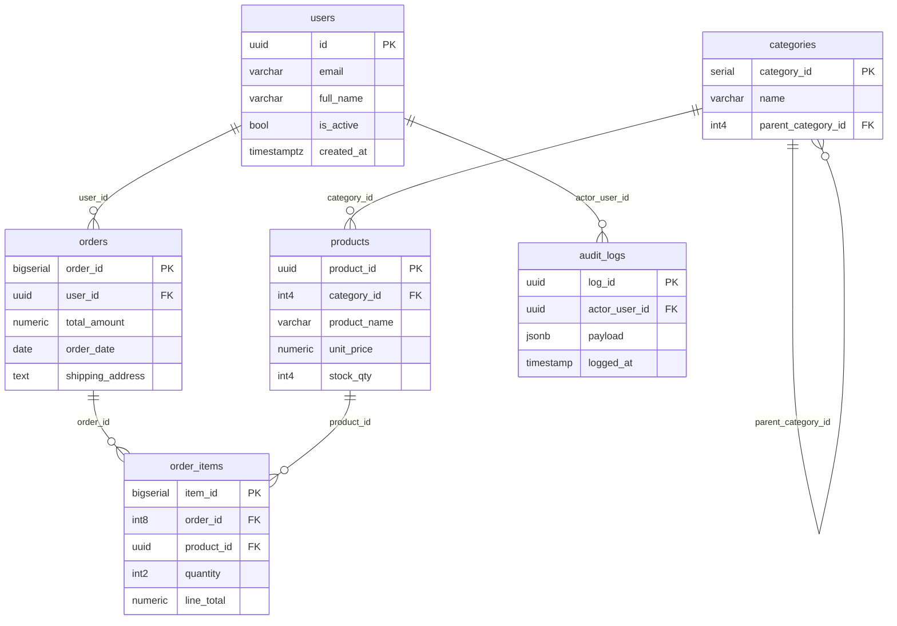

# STRUCTURA — PostgreSQL Entity-Relationship Blueprint

- **Generated At:** `2026-11-08 23:51:54`
- **Source Instance:** `postgres@localhost:5432/postgres`
- **Tables Mapped:** `6`

```mermaid
erDiagram
    users {
        uuid id PK
        varchar email
        varchar full_name
        bool is_active
        timestamptz created_at
    }
    categories {
        serial category_id PK
        varchar name
        int4 parent_category_id FK
    }
    products {
        uuid product_id PK
        int4 category_id FK
        varchar product_name
        numeric unit_price
        int4 stock_qty
    }
    orders {
        bigserial order_id PK
        uuid user_id FK
        numeric total_amount
        date order_date
        text shipping_address
    }
    order_items {
        bigserial item_id PK
        int8 order_id FK
        uuid product_id FK
        int2 quantity
        numeric line_total
    }
    audit_logs {
        uuid log_id PK
        uuid actor_user_id FK
        jsonb payload
        timestamp logged_at
    }
    categories ||--o{ categories : "parent_category_id"
    categories ||--o{ products : "category_id"
    orders ||--o{ order_items : "order_id"
    products ||--o{ order_items : "product_id"
    users ||--o{ audit_logs : "actor_user_id"
    users ||--o{ orders : "user_id"
```
